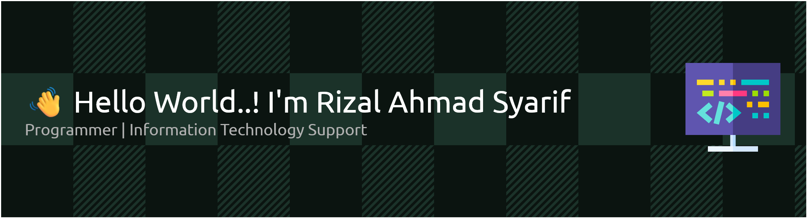

<!--
**rizalahmadsyariff/rizalahmadsyariff** is a ✨ _special_ ✨ repository because its `README.md` (this file) appears on your GitHub profile.

Here are some ideas to get you started:

🔭 I’m currently working on freelance on statistic office
🌱 I’m currently learning Laravel,Javascript
- 👯 I’m looking to collaborate on ...
- 🤔 I’m looking for help with ...
- 💬 Ask me about ...
- 📫 How to reach me: ...
- 😄 Pronouns: ...
- ⚡ Fun fact: ...
-->

#### 💻 Tech Stack: 

#### ➕ additional skills:

#### 🌐 Socials:

 
